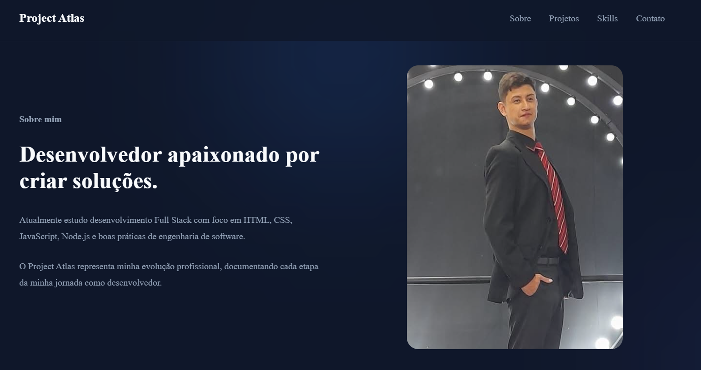

# 🚀 Project Atlas

Meu portfólio profissional desenvolvido para documentar minha evolução como Desenvolvedor Full Stack.

O objetivo deste projeto é apresentar meus trabalhos, habilidades e evolução técnica através de uma interface moderna, responsiva e construída com boas práticas de desenvolvimento web.

---

## ✨ Tecnologias

- HTML5
- CSS3
- JavaScript
- Git
- GitHub

---

## 📸 Preview



---

## 📁 Estrutura

```text
project-atlas/
│
├── assets/
│   ├── icons/
│   └── images/
│
├── index.html
├── style.css
├── script.js
└── README.md
```

---

## 🚀 Como executar

Clone o repositório:

```bash
git clone https://github.com/SEU-USUARIO/project-atlas.git
```

Abra o arquivo:

```
index.html
```

Ou utilize a extensão **Live Server** no VS Code.

---

## 🛣️ Roadmap

- [x] Hero
- [x] About
- [x] Projects
- [x] Skills
- [x] Contact
- [x] Footer
- [x] Responsividade
- [x] Scroll Reveal
- [x] SEO
- [x] Favicon
- [ ] Deploy
- [ ] Melhorias futuras

---

## 👨‍💻 Autor

**Arom Vinicius Hano Barsallo**

GitHub:
https://github.com/AromHanoB

LinkedIn:
(adicionar)

---

## 📄 Licença

Este projeto foi desenvolvido para fins de estudo e composição de portfólio.